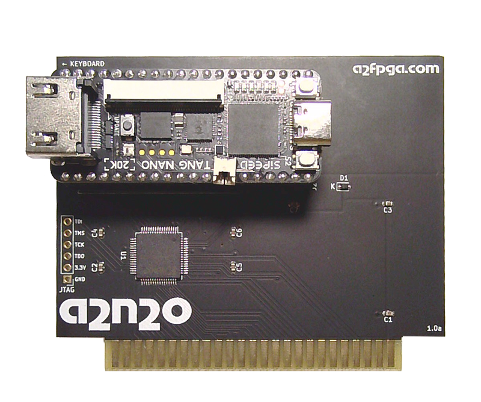

# A2N20v1 Card

  

This is the project version that builds the FPGA bitstream for the 
[Tang Nano 20K](https://wiki.sipeed.com/hardware/en/tang/tang-nano-20k/nano-20k.html)
version of the A2FPGA Apple II card.

The A2N20v1 version only supports Apple II and //e models.  The card will not
work correctly in a IIgs.  The v1 card uses a 64-pin "a2bridge" CPLD to interface
and level-shift the Apple II bus that unfortunately does not capture the Apple IIgs 
M2SEL and M2B0 signals necessary for correctly capturing IIgs memory addresses on the bus.

[A2N20v1 Schematics](sch/a2n20v1.pdf)

It supports all graphics modes on all Apple II models, although software written
for //e double-hires will not usually run on a II, nor will IIgs software run on
a II or //e.  However, the soft switches and display modes are supported on all
models for software you write yourself.

To update the bitstream on the A2N20v1, the most convenient way is to use [OpenFPGALoader](https://github.com/trabucayre/openFPGALoader)
Mac users with [Homebrew](https://brew.sh/) can just type `brew install openfpgaloader` in the Terminal to install it
Use OpenFPGALoader to program the Tang Nano 20K board via USB with the [a2n20v1.fs](impl/pnr/a2n20v1.fs) bistream file and run `openfpgaloader -b tangnano20k -f a2n20v1.fs`

The project can also be opened and built with the Gowin IDE, either educational
or commercial editions.  Use the `a2n20v1.gprj` file in this folder.

Note: When using the Gowin IDE, do not add or remove files from the project or it will
turn the relative file paths into absolute file paths.

