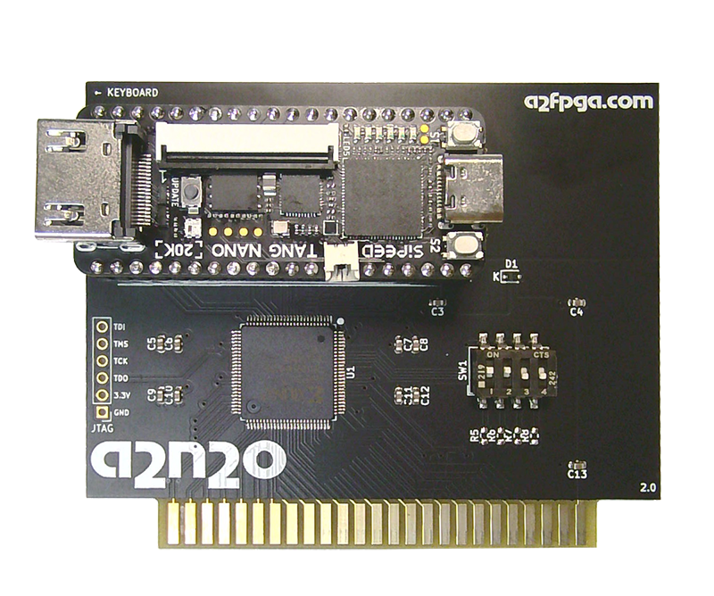

# A2N20v2 Card

  

This is the project version that builds the FPGA bitstream for the 
[Tang Nano 20K](https://wiki.sipeed.com/hardware/en/tang/tang-nano-20k/nano-20k.html)
version of the A2FPGA Apple II card.

The A2N20v2 version supports Apple II, //e, and IIgs models. The v2 card uses a 100-pin 
"a2bridge" CPLD that captures and level-shifts all Apple II, //e, and IIgs signals including the
M2SEL and M2B0 signals necessary for interfacing to the IIgs bus.

[A2N20v2 Schematics](sch/a2n20v2.pdf)

It supports all graphics modes on all Apple II models, although software written
for //e double-hires will not usually run on a II, nor will IIgs software run on
a II or //e.  However, the soft switches and display modes are supported on all
models for software you write yourself.

The A2N20v2 has a 4-switch DIP switch that controls the following settings:

1. Enable Scanline effect when set to on 
2. Enable Apple II speaker sounds via HDMI when set to on
3. Power-on-Reset Hold - Delay Apple II start-up until FPGA is initialized and running
4. Apple IIgs - Set to on when installed in an Apple IIgs

For ROM 00/01 IIgs models (such as the Woz edition), the A2N20v2 must be placed in Slot 3.  For ROM 03 models, it should work in any slot. This is because it requires the M2B0 signal which is only present in Slot 3 of the original IIgs models, but which is present in slots 1 to size of the ROM 03 model. 

To update the bitstream on the A2N20v2, the most convenient way is to use [OpenFPGALoader](https://github.com/trabucayre/openFPGALoader)
Mac users with [Homebrew](https://brew.sh/) can just type `brew install openfpgaloader` in the Terminal to install it
Use OpenFPGALoader to program the Tang Nano 20K board via USB with the [a2n20v2.fs](impl/pnr/a2n20v2.fs) bistream file and run `openfpgaloader -b tangnano20k -f a2n20v2.fs`

The project can also be opened and built with the Gowin IDE, either educational
or commercial editions.  Use the `a2n20v2.gprj` file in this folder.

Note: When using the Gowin IDE, do not add or remove files from the project or it will
turn the relative file paths into absolute file paths.
