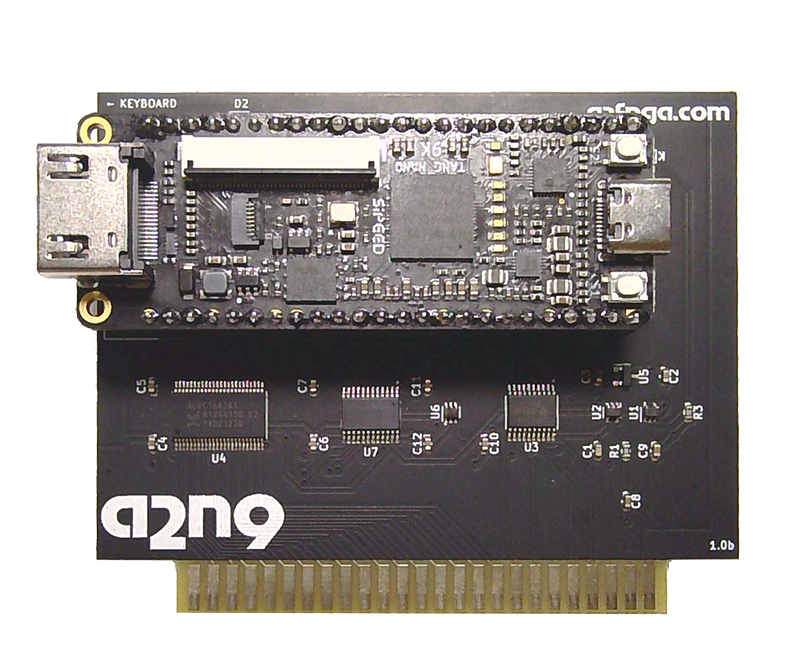

# A2N9 Card

  

This is the project version that builds the FPGA bitstream for the 
[Tang Nano 9K](https://wiki.sipeed.com/hardware/en/tang/Tang-Nano-9K/Nano-9K.html)
version of the A2FPGA Apple II card.

The A2N9 version only supports Apple II and //e models.  The card will not
work correctly in a IIgs.  It uses discrete 74* series logic to interface
and level-shift the necessary Apple II bus signals to the FPGA module.

[A2N9 Schematics](sch/a2n9.pdf)

The A2N9 does the build have support for IIgs graphics modes. However all II and //e modes and 
soft switches are supported on any II or //e model even those most software will not use //e 
features on non-//e models.

It also does not have the SuperSprite capability included.

To update the bitstream on the A2N9, the most convenient way is to use [OpenFPGALoader](https://github.com/trabucayre/openFPGALoader)
Mac users with [Homebrew](https://brew.sh/) can just type `brew install openfpgaloader` in the Terminal to install it
Use OpenFPGALoader to program the Tang Nano 9K board via USB with the [a2n9.fs](impl/pnr/a2n9.fs) bistream file and run `openfpgaloader -b tangnano9k -f a2n9.fs`

The project can also be opened and built with the Gowin IDE, either educational
or commercial editions.  Use the `a2n9.gprj` file in this folder.

Note: When using the Gowin IDE, do not add or remove files from the project or it will
turn the relative file paths into absolute file paths.

